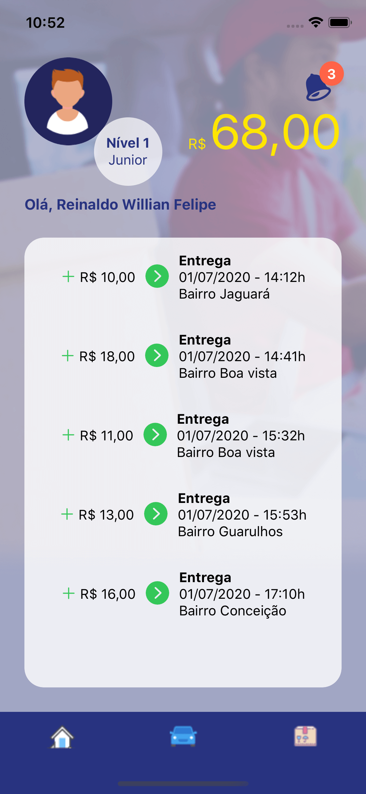
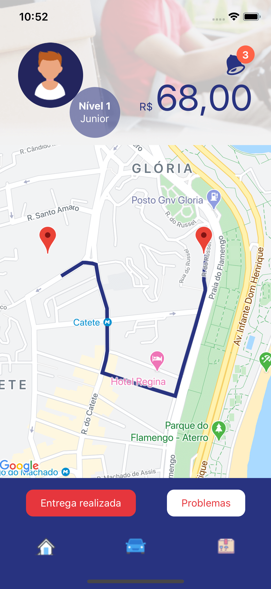

<p  align="center">

</p>

<p  align="center">
Melidriver é um App para motoristas parceiros do mercado livre. A fim de reduzir a complexidade logística do MELI e possibilitar que recebam uma renda extra, beneficiando tanto a cia quando o consumidores.
</p>

<p  align="center">


</p>

#### Tecnologia:
O app foi desenvolvido em React Native com ajuda do Expo, para facilitar a visualização por vários dispositivos em tempo de desenvolvimento. O React Native permite o desenvolvimento de apps para Android e IOS utilizando Javascript.

#### Ferramentas em destaque no projeto:

* `React Navigation` é utilizado para viabilizar a navegação do usuário pelo app de forma atráves de botões e da barra inferior
* ```Redux``` é utilizado para criar uma fonte única de verdade no app, ou a chamada `loja`, que armazena os dados do app e somente atravez de ações enviadas para esta loja, as informações podem ser alteradas. Isso garante imutabilidade das informações e garante um app mais estável.
